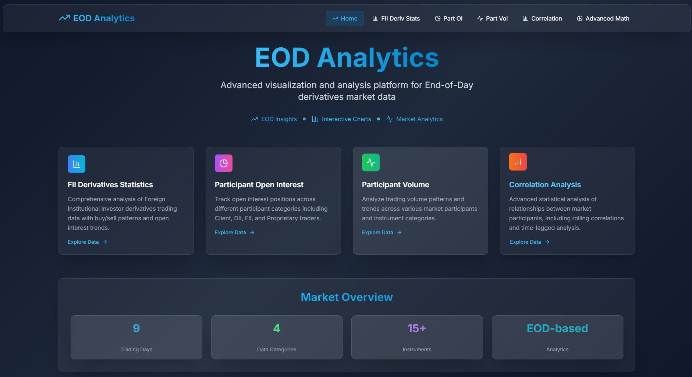
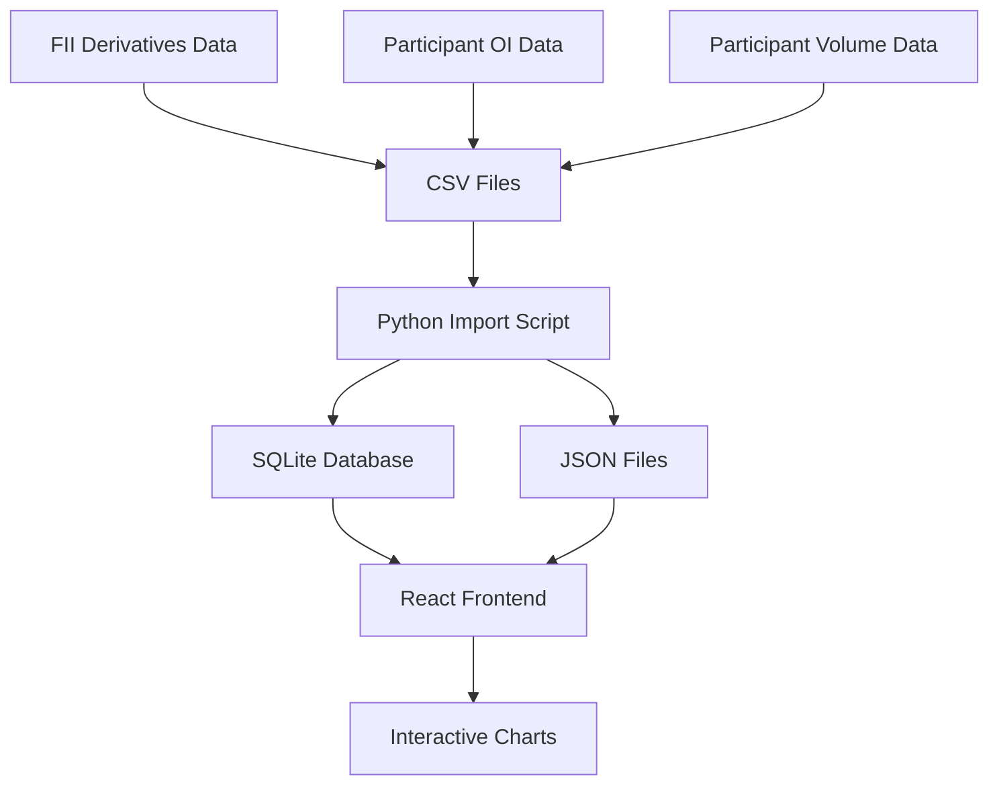
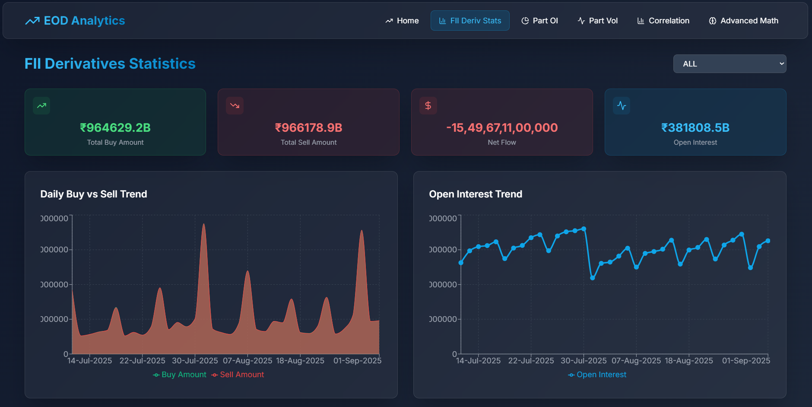
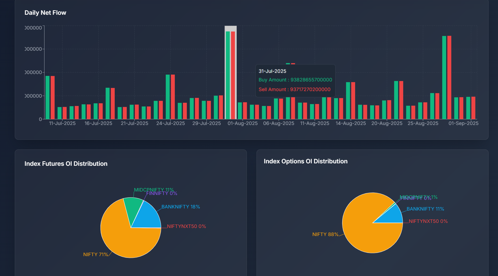
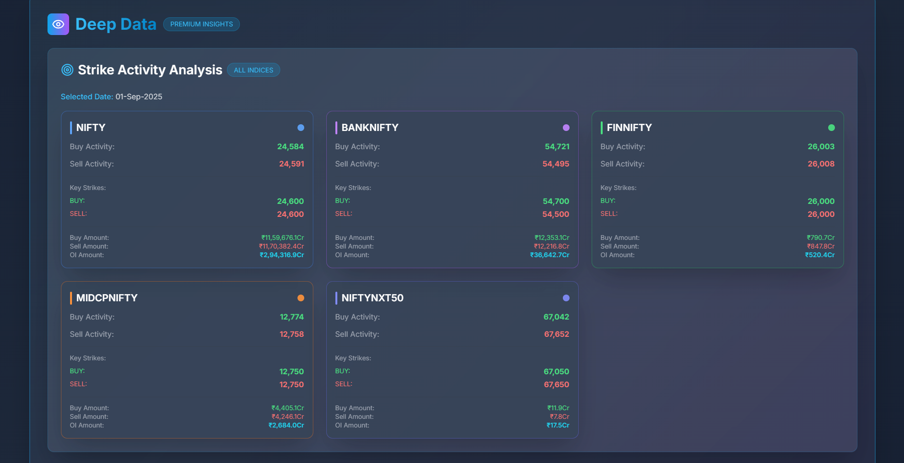
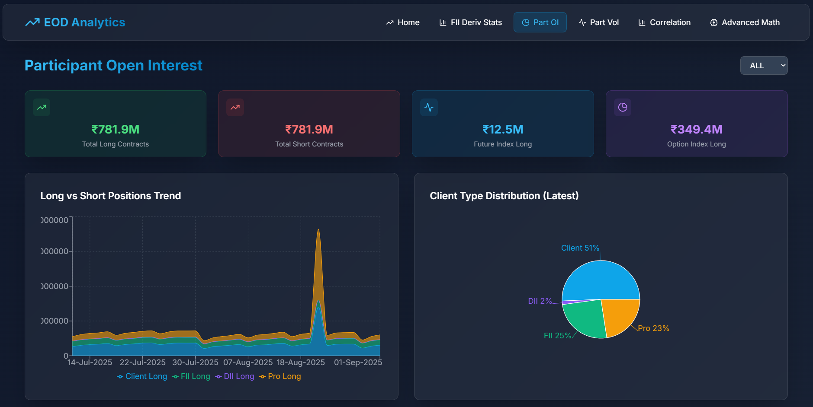
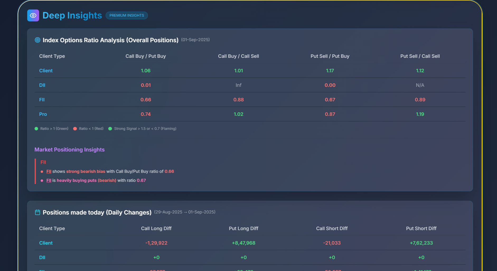
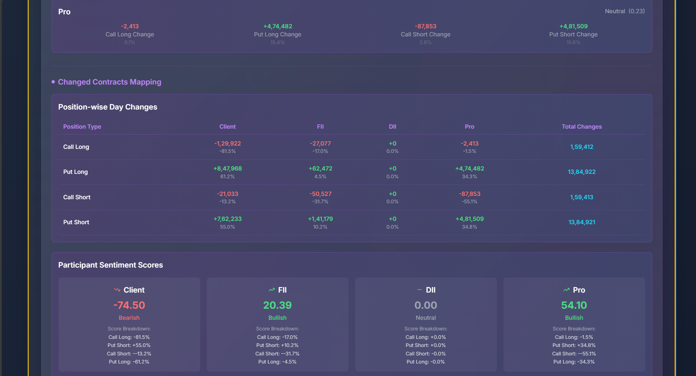
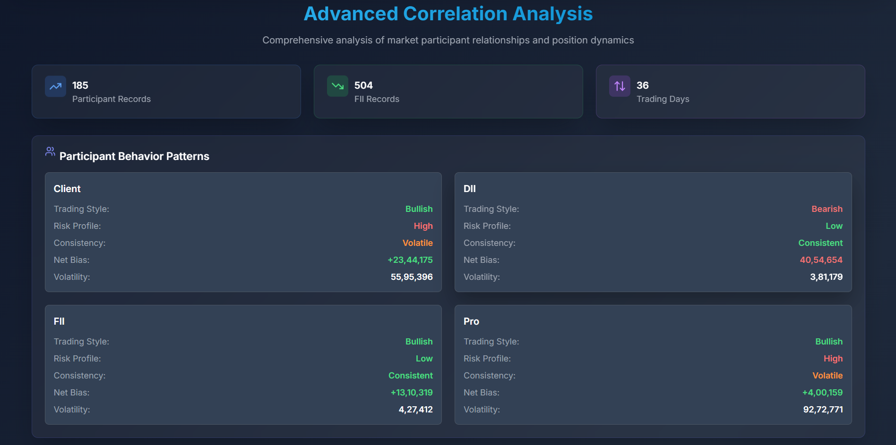
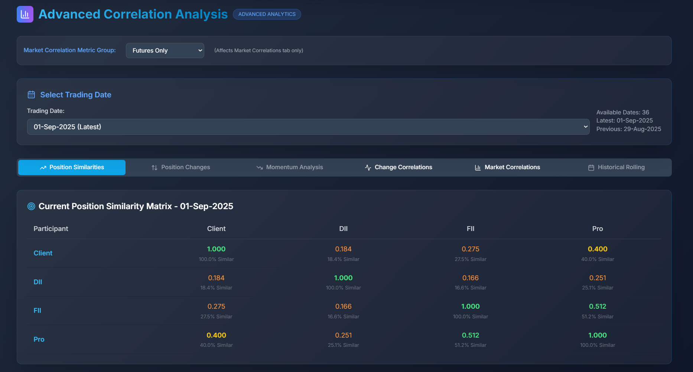

# 📊 EOD Analytics Platform

<div align="center">


**Advanced visualization and analysis platform for End-of-Day derivatives market data**


</div>

---

## 🚀 Overview

EOD Analytics is a comprehensive financial data analysis platform designed to process, visualize, and analyze End-of-Day derivatives market data. The platform provides sophisticated insights into Foreign Institutional Investor (FII) trading patterns, participant open interest, trading volumes, and advanced correlation analysis.

### 🎯 Key Features

- **📈 FII Derivatives Statistics**: Comprehensive analysis of FII derivatives trading data with buy/sell patterns and open interest trends
- **📊 Participant Open Interest**: Track open interest positions across different participant categories (Client, DII, FII, Proprietary)
- **📉 Trading Volume Analysis**: Analyze trading volume patterns and trends across various market participants
- **🔗 Correlation Analysis**: Advanced statistical analysis of relationships between market participants
- **📱 Responsive Design**: Modern, mobile-friendly interface with smooth animations
- **⚡ Real-time Data Processing**: Efficient data import and export capabilities

---

## 🏗️ Architecture

### Technology Stack

**Frontend:**
- ⚛️ React 18.2.0 with Vite
- 🎨 Tailwind CSS for styling
- 📊 Recharts for data visualization
- 🎭 Lucide React for icons
- 🚀 React Router for navigation

**Backend/Data Processing:**
- 🐍 Python 3.x
- 🗄️ SQLite for data storage
- 📊 Pandas for data manipulation
- 📁 CSV data import/export

### Data Flow



---

## 📁 Project Structure

```
EOD Analyzer/
├── 📊 Data Sources/
│   ├── fii_der/                    # FII derivatives CSV files
│   ├── part_w_oi/                  # Participant Open Interest data
│   └── part_w_vol/                 # Participant Volume data
├── 🐍 Python Scripts/
│   ├── import_fii_der.py          # Data import and processing
│   ├── db_to_json.py              # Database to JSON conversion
│   └── view_eod_data.py           # Data viewing utilities
├── ⚛️ React Application/
│   ├── my-eod-app/
│   │   ├── src/
│   │   │   ├── components/        # Reusable UI components
│   │   │   ├── pages/            # Application pages
│   │   │   └── utils/            # Utility functions
│   │   └── public/data/          # JSON data files
│   └── eod_data.db               # SQLite database
└── 📚 Documentation/
    └── README.md                 # This file
```

---

## 🚀 Quick Start

### Prerequisites

- **Node.js** (v16 or higher)
- **Python** (v3.8 or higher)
- **npm** or **yarn**

### Installation

1. **Clone the repository**
   ```bash
   git clone https://github.com/yourusername/eod-analyzer.git
   cd eod-analyzer
   ```

2. **Install Python dependencies**
   ```bash
   pip install pandas sqlite3
   ```

3. **Import market data**
   ```bash
   python import_fii_der.py
   ```

4. **Convert database to JSON**
   ```bash
   python db_to_json.py
   ```

5. **Install React dependencies**
   ```bash
   cd my-eod-app
   npm install
   ```

6. **Start the development server**
   ```bash
   npm run dev
   ```

7. **Open your browser**
   Navigate to `http://localhost:5173`

---

## 📊 Data Sources

The platform processes three main types of market data:

### 1. FII Derivatives Data
- **Source**: NSE FII derivatives statistics
- **Instruments**: NIFTY, BANKNIFTY, FINNIFTY, MIDCPNIFTY, NIFTYNXT50
- **Metrics**: Buy/Sell contracts, amounts, Open Interest
- **Frequency**: Daily EOD data

### 2. Participant Open Interest
- **Source**: NSE participant-wise open interest data
- **Categories**: Client, DII, FII, Proprietary
- **Instruments**: Index Futures, Stock Futures, Index Options, Stock Options
- **Metrics**: Long/Short positions across all categories

### 3. Participant Volume
- **Source**: NSE participant-wise trading volume
- **Categories**: Same as Open Interest
- **Metrics**: Trading volumes across different instrument categories

---

## 🔧 Configuration

### Data Import Settings

The platform supports various instrument multipliers for accurate calculations:

```python
INSTRUMENT_MULTIPLIERS = {
    'BANKNIFTY': 35,
    'NIFTY': 75,
    'MIDCPNIFTY': 140,
    'FINNIFTY': 65,
    'NIFTYNXT50': 25
}
```

### Supported Instruments

- **Index Futures**: NIFTY, BANKNIFTY, FINNIFTY, MIDCPNIFTY, NIFTYNXT50
- **Index Options**: All index-based options
- **Stock Futures**: Individual stock futures
- **Stock Options**: Individual stock options

---

## 📈 Features in Detail

### 🎨 Interactive Dashboard
- Modern, responsive design with smooth animations
- Real-time data visualization with Recharts
- Mobile-friendly interface
- Dark theme optimized for financial data

### 📊 Advanced Analytics
- **Correlation Analysis**: Statistical relationships between market participants
- **Trend Analysis**: Historical pattern recognition
- **Volume Analysis**: Trading volume insights
- **Position Analysis**: Open interest tracking

### 🔄 Data Processing
- Automated CSV data import
- Data validation and cleaning
- Multi-format date parsing
- Error handling and logging

---

## 🗄️ Database Migration

### From DuckDB to JSON

The project has evolved from using DuckDB to a JSON-based data structure for the following reasons:

1. **Simplified Deployment**: JSON files eliminate database server dependencies
2. **Enhanced Portability**: Easier to share and deploy across different environments
3. **Improved Performance**: Faster data loading for web applications
4. **Better Integration**: Seamless integration with React frontend
5. **Data Restructuring**: Opportunity to optimize data schema for web consumption

### Future Database Plans

In upcoming versions, the platform will migrate to **PostgreSQL** for:
- **Scalability**: Better handling of large datasets
- **Advanced Queries**: Complex analytical queries
- **Data Integrity**: ACID compliance and data consistency
- **Performance**: Optimized for financial data analytics
- **Real-time Updates**: Live data streaming capabilities

---

## 🛠️ Development

### Available Scripts

```bash
# Development
npm run dev          # Start development server
npm run build        # Build for production
npm run preview      # Preview production build
npm run lint         # Run ESLint

# Data Processing
python import_fii_der.py    # Import CSV data to database
python db_to_json.py        # Export database to JSON
python view_eod_data.py     # View database contents
```

### Code Structure

- **Components**: Reusable UI components in `src/components/`
- **Pages**: Main application pages in `src/pages/`
- **Utils**: Helper functions and utilities in `src/utils/`
- **Data**: JSON data files in `public/data/`

---

## 📊 Screenshots

### Dashboard Overview


### FII Derivatives Analysis




### Participant Open Interest




### Correlation Analysis



---

## 🤝 Contributing

We welcome contributions! Please follow these steps:

1. **Fork the repository**
2. **Create a feature branch** (`git checkout -b feature/amazing-feature`)
3. **Commit your changes** (`git commit -m 'Add amazing feature'`)
4. **Push to the branch** (`git push origin feature/amazing-feature`)
5. **Open a Pull Request**

### Development Guidelines

- Follow the existing code style
- Add tests for new features
- Update documentation as needed
- Ensure all tests pass before submitting

---

## 📝 License

This project is licensed under the **MIT License** - see the [LICENSE](LICENSE) file for details.

```
MIT License

Copyright (c) 2025 EOD Analytics Platform

Permission is hereby granted, free of charge, to any person obtaining a copy
of this software and associated documentation files (the "Software"), to deal
in the Software without restriction, including without limitation the rights
to use, copy, modify, merge, publish, distribute, sublicense, and/or sell
copies of the Software, and to permit persons to whom the Software is
furnished to do so, subject to the following conditions:

The above copyright notice and this permission notice shall be included in all
copies or substantial portions of the Software.

THE SOFTWARE IS PROVIDED "AS IS", WITHOUT WARRANTY OF ANY KIND, EXPRESS OR
IMPLIED, INCLUDING BUT NOT LIMITED TO THE WARRANTIES OF MERCHANTABILITY,
FITNESS FOR A PARTICULAR PURPOSE AND NONINFRINGEMENT. IN NO EVENT SHALL THE
AUTHORS OR COPYRIGHT HOLDERS BE LIABLE FOR ANY CLAIM, DAMAGES OR OTHER
LIABILITY, WHETHER IN AN ACTION OF CONTRACT, TORT OR OTHERWISE, ARISING FROM,
OUT OF OR IN CONNECTION WITH THE SOFTWARE OR THE USE OR OTHER DEALINGS IN THE
SOFTWARE.
```

---

## 🚀 Roadmap

### Version 2.0 (Planned)
- [ ] PostgreSQL database integration
- [ ] Real-time data streaming
- [ ] Advanced machine learning models
- [ ] API endpoints for data access
- [ ] User authentication and authorization
- [ ] Custom dashboard creation
- [ ] Export functionality (PDF, Excel)

### Version 3.0 (Future)
- [ ] Mobile application
- [ ] Cloud deployment
- [ ] Multi-market support
- [ ] Advanced backtesting capabilities
- [ ] Social trading features

---

## 📞 Support

For support, email [your-email@example.com] or create an issue in the repository.

---

## 🙏 Acknowledgments

- **NSE India** for providing comprehensive market data
- **React Community** for excellent documentation and tools
- **Recharts** for beautiful chart components
- **Tailwind CSS** for the utility-first CSS framework

---

<div align="center">

**Made with ❤️ for the financial analytics community**

<!-- [](https://github.com/ryuzaki-ved/eod-analyzer)
[](https://github.com/ryuzaki-ved/eod-analyzer) -->

</div>
